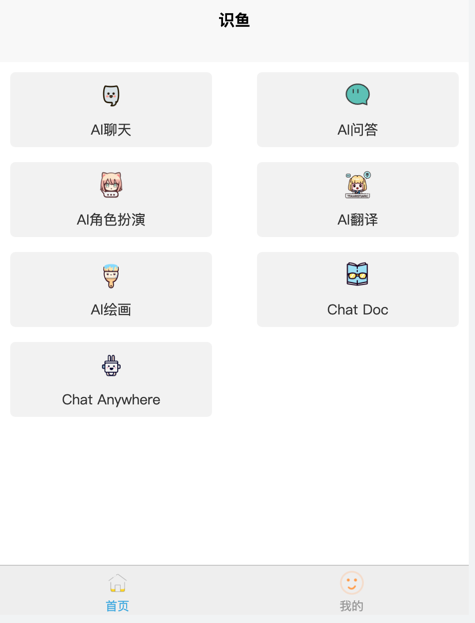
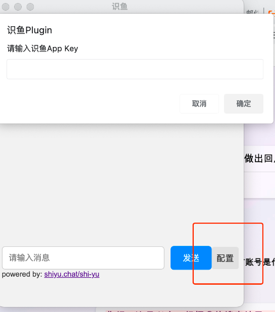

# 识鱼【ChatGPT后端】

## Introduce
> 识鱼是一款基于ChatGPT的AI聊天工具。
> 1. 支持IOS Android Chrome跨端使用
> 2. 支持Android插件端，可以在任意APP内使用ChatGPT

识鱼网址：

https://shiyu.chat/shi-yu

QQ交流群：
> 765139085

## how to run 
go run main.go --config=config-dev.ini

## show
### 前端界面展示

### 手机插件端使用展示
1. 在任意APP内输入指令 
2. 得到答案

* 

### Chrome插件使用
1. chrome内任意右键

2. 配置识鱼appkey，开始使用
